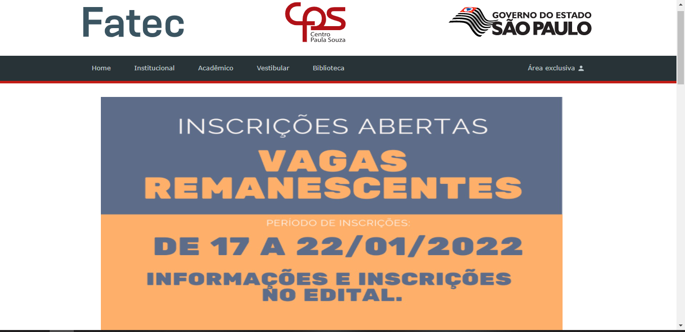

<h1 align="center">
   Pagina inicial Fatec de Cotia - Clone
</h1>

<h4 align="center">
  Projeto criado com o intuito de aprimorar meus conhecimentos nas tecnologias HTML, CSS e JS.
</h4>

## 📚 Seções
O projeto é composto por uma pagina que contem 4 seções:

- **Carousel de img:** Em construção;
- **Graduação:** Conteudo informativo acerca dos cursos disponiveis;
- **Noticias:** Novidades sobre a instituição e cursos;
- **Calendário:** Calendario de ano letivo;

---

## 💼 Tecnologias utilizadas
Para o desenvolvimento deste projeto utilizei as seguintes tecnologias:

- HTML;
- CSS;
- JavaScript;
---

#### Autor
Willian Stephano